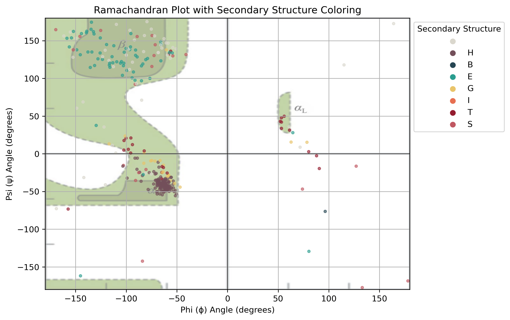
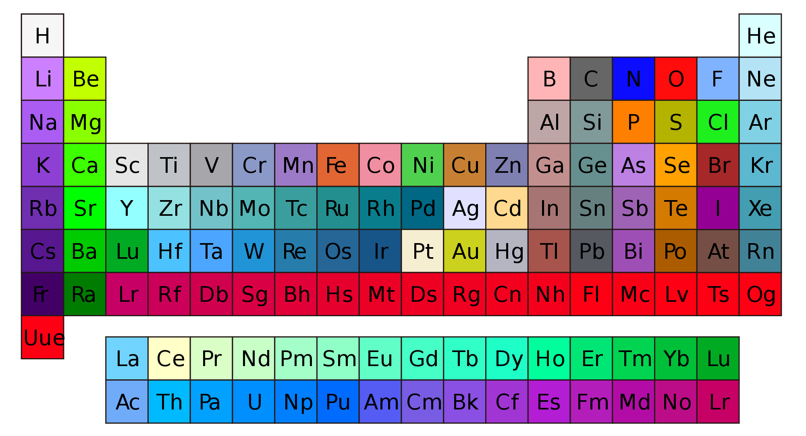
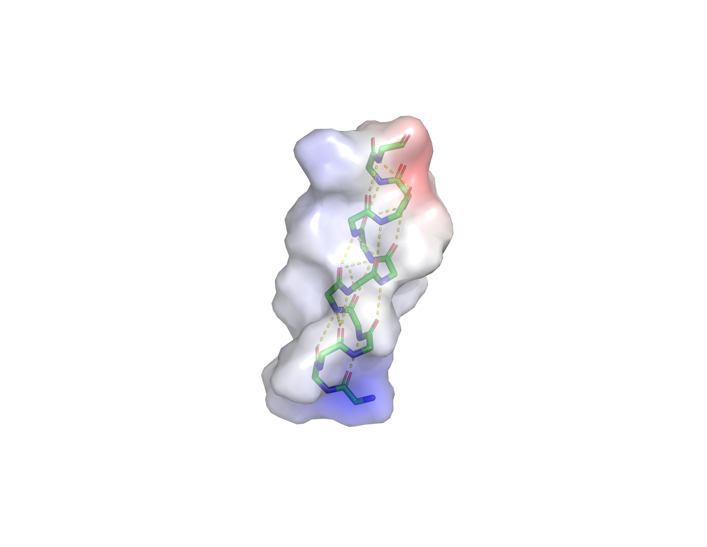

= Protein Structure Workshop
:icons: font
:source-highlighter: rouge
:toc: left

== PyMOL
image::Pictures/PyMOL_logo.svg.png[width=100]
PyMOL is a molecular visualization program written in Python, hence the 'Py' suffix.
It was released for the first time in 2000 as an open source and free software by DeLano Scientific LLC with a vision of open science.
Since 2010 it is commercialized by Schrödinger, Inc. and some of the source code are no longer released.
Pymol can be downloaded in Schrödinger's link:https://pymol.org/2/[webpage], including its source code.

Alternative programs are link:https://www.cgl.ucsf.edu/chimera/[Chimera], link:http://www.openrasmol.org/[RasMOL], link:https://www.ks.uiuc.edu/Research/vmd/[VMD] (specially useful for molecular dynamics) and
link:https://www2.mrc-lmb.cam.ac.uk/personal/pemsley/coot/[Coot] (specially useful for building and validating models with crystallographic data).

PyMOL works both with graphical interface and command line.

image::Pictures/Picture1.png[]

Those many options allow different ways of working with molecules to do the same things.
Throughout this tutorial we will show both ways, mouse actions and command lines, whenever possible.
Mouse actions will start with # and will be coloured in [olive]#olive#.
Command lines will follow > and will be highlighted as Python codes.

We can open a structure file in different ways:
[source,python]
----
# File -> Open... -> ... select downloaded 1t2d.pdb file
>
load /path2file/1t2d.pdb
----

After uploaded, the structure will appear as a new object at the sidebar with the name of the file without the .pdb extension.
Note that if you try to load it again, a second state will be added to the same object, as indicated by the green numbers at the object tab.

image::Pictures/Picture2.png[width=200]

This is convenient when you have different models for the same structure, like proteins solved by Nuclear Magnetic Resonance, or different conformations of Molecular Dynamics, or different frames of a protein trajectory movie.
Let's change the name of this object to avoid loading states onto it.

[source,python]
----
# Action of 1t2d -> rename object -> Renaming 1t2d to 1t2d_pdb
>
set_name 1t2d, 1t2d_pdb
----

Another way to upload a structure is by online fetching.
This feature automatically searches for a .cif file in the online PDB with the given PDB code.
[source,python]
----
# File -> Get PDB... -> 1t2d
>
fetch 1t2d
----

Now you should have 2 objects displayed at your sidebar.
A click at the name of an object will disable or enable it.

The .pdb and .cif files have slightly different features in PyMOL, including how they're loaded.
One difference is at the displayed sequence.
Enable the sequence bar with the S button.
Note that the first residue in the sequence of 1t2d object, which came from the .cif file, appears in grey.
This is a missing residue, which in the .pdb file in disregarded.

image::Pictures/Picture3.png[]

Let's work only with the 1t2d object and delete the other one.
[source,python]
----
# Action of 1t2d_pdb -> delete object
>
delete 1t2d_pdb
----
Roll the sequence bar and note that this 1t2d object has 5 chains: A is the protein, B is oxalate ion, C is NAD, D is glycerol and E are water molecules.
For the sake of easily analysing the protein structure, let's remove the water molecules.
[source,python]
----
# Action of 1t2d -> remove waters
>
remove solvent
----
Note that chain E is gone.

Protein structures are automatically loaded in the cartoon representation mode, as listed in the Show tab.
In the cartoon mode, helices and strands are displayed as helices and arrows, respectively.
These two secondary structures (ss) can be easily differentiated by colour.

image::Pictures/Picture4.png[width=500]

[source,python]
----
# Color of 1t2d -> by ss -> choose first option
>
color red, ss h
color yellow, ss s
color green, ss l+''
----
== DSSP and Ramachandran

The secondary structures assigned by PyMOL are rather simple and don't distinguish between different types of helices, strands or loops.
It may also deviate a little from different versions of PyMOL.
The standard, and more rigorous, method to assign secondary structures is called link:https://swift.cmbi.umcn.nl/gv/dssp/[DSSP], an acronym for Define Secondary Structure of Proteins.
Connected to slurm, we need to briefly load dssp program and a python library for plotting the results.
Then go to the workshop's folder, create a folder for you and copy the scripts we are going to use to your folder.
[source,sh]
----
module load dssp
module load matplotlib
cd /filer/projekte/protein_structure/
mkdir amanda
cd amanda
cp ../scripts/* .
----

The dssp program outputs lots of information on hydrogen bonds and other geometrical features taken from the protein coordinates and used to assign the secondary structures
(more information link:https://swift.cmbi.umcn.nl/gv/dssp/[here]).
It also outputs information on solvent accessibility, for instance, but we are only interested on the assigned ss, so we will clean up the output file from dssp to use as in input to PyMOL.
Copy the downloaded 1t2d.pdb to your folder in slurm and run the following command.
[source,sh]
----
>
bash ssinfo.sh 1t2d.pdb // <1>
----
<1> The first line in this script runs the dssp program and the rest cleans the dssp output.

We can now easily process this information into a coloured matrix to indicate ss into a plot and into PyMOL. We will do this with two python scripts.
They both take a list of files to process as in input.
This list of files is simply a list of the name of the .txt file we just created, followed by the name of the monomers or chains that they contain.
So first create a file named "dsspfileslist.txt".
[source,sh]
----
>
vi dsspfileslist.txt
----
In VI press the letter i to start writing and type:
----
1t2d_dssp.txt monomerA
----
Leave the insert mode by pressing esc and then save and close tipping :wq

This way of processing files, with a list of input files, is handy to compare different structures and monomers, where each line corresponds to one entry.
But for us, it just takes one file with one monomer.
Now we can create a colour map and an input file for PyMOL.
[source,sh]
----
>
python plot_dssp_colorbars.py dsspfileslist.txt
python dssp2pymol.py dsspfileslist.txt
----
Take a look at the python scripts you just used.
At the top of them there is a HEX colour code that you can change as you prefer.
You must have two output files now, monomerA_dssp.png and 1t2d_dssp.pml.
Copy them to your folder in your local Dektop to open them.
monomerA_dssp.png is a figure with a coloured matrix indicating the ss,

image::Pictures/Picture5.png[width=500]

and 1t2d_dssp.pml is a file with commands to be read by PyMOL.
Let's open it with PyMOL.
[source, python]
----
# File -> Open... -> 1t2d_dssp.pml
>
load /path2file/1t2d_dssp.pml
----
Let's compare both ways of coloring in PyMOL.
Duplicate the 1t2d object and color it again as default by PyMOL.
[source,python]
----
# Action of 1t2d -> copy to object -> new
# Color of obj01 -> by SS -> choose first option
>
copy obj01, 1t2d
color red, obj01 and ss h
color yellow, obj01 and ss s
color green, obj01 and ss l+''
----

image::Pictures/Picture6.png[]

Note how some strange helical turns are differently assigned by DSSP. When you are finished comparing the structures, delete obj01.
[source, python]
----
# Action of obj01 -> delete object
>
delete obj01
----

Another common way of coloring the protein structure is by the residues count.
From blue to red in a rainbow scale.
[source,python]
----
# Color of 1t2d -> spectrum -> rainbow
>
spectrum count, rainbow, 1t2d
----

image::Pictures/Picture6b.png[width=500]

From the python script, it is clear how any color can be selected using HEX codes with the command line. But any color can be created with mouse actions as well.

[source,python]
----
# Settings -> Colors... -> Red 0,17 Green 0,66 Blue 0,74 Name NewBlue -> Apply
>
set_color NewBlue, [43, 168, 189]
----

Let's make more use of the DSSP program and analyse the torsion angles of each residue by plotting a Ramachandran Plot.
Just give the dssp output file, 1t2d.dssp, as input to another python script, plot_ramachandran_ss.py.
[source, sh]
----
python plot_ramachandran_ss.py 1t2d.dssp
----

Do all residues fall within the expected regions?

== Selecting and measuring contacts

In the view mode of the mouse, click the left button and move to rotate the protein structure.
Click the right button and move to zoom in and out.
Ctrl (or strg in German or command on Mac) + mouse left button to move the object on the image plane.
Other mouse functions together with keyboard shortcuts are possible, but they vary with mouse type.
Make sure the Selecting mode displays "Residues". Clicking on it again will change to other selection options.
Rotating the structure, see if you can find and select the first residue.
The first residue can also be selected at the sequence bar.
Now see if you can identify and select the alternating six beta strands and  five alpha helices that form the Rossmann fold.
Color the entire protein in white and highlight the Rossmann coloring its ss.
[source,python]
----
# Color of 1t2d -> grays -> white
# in the sequence bar select residues 1-149
# Action of (sele) -> rename selection -> Renaming sele to Rossmann
# Disable (Rossmann)
# Color of (Rossmann) -> by ss -> first option
>
color white, 1t2d
select Rossmann, 1t2d and resid 1-149
color red, Rossmann and ss h
color yellow, Rossmann and ss s
color green, Rossmann and ss l+''
----

image::Pictures/PictureA.png[width=500]

Note that NAD lies right above the Rossmann fold and let's color it regarding its atoms.
Contrary to the cartoon representation, in representations with atomic resolution PyMOL follows the link:https://en.wikipedia.org/wiki/CPK_coloring[CPK colour convention].
Except for carbons.
In CPK, nitrogen is blue, oxygen is red and phosphorus is orange, for example.

[source,python]
----
# select the NAD molecule
# Action of (sele) -> rename selection -> Renaming sele to NAD
# Disable (NAD)
# Color of (NAD) -> by element -> first option
>
select NAD, 1t2d and resname NAD
color atomic, NAD and (not element C)
----

image::Pictures/PictureB.png[width=500]

Now, find the residues that make polar contacts with NAD
[source, python]
----
# Action of (NAD) -> find -> polar contacts -> to other atoms in object
>
dist Hbonds, (NAD), 1t2d, mode=2
----
This created dashed lines to all hydrogen bonds found between NAD and the rest of the object.
But some lines point to nothing. Let's find out what are at the other end of these lines.
[source,python]
----
# Action of (NAD) -> modify -> around -> residues within 4 A
# Action of (NAD) -> rename selection -> Renaming NAD to aroundNAD
# Show of (aroundNAD) -> sticks
# Disable (aroundNAD)
>
select aroundNAD, byres all within 4 of (NAD)
show sticks, aroundNAD
----
Try to identify exactly which residues make hydrogen bonds with NAD.
[source,python]
----
# select residues contacting NAD
# Action of (sele) -> rename selection -> Renaming sele to resbond
# Disable (resbond)
# Hide of (aroundNAD) -> sticks
# Show of (resbond) -> sticks
>
select resbond, resid 13+14+34+66+80+124+126+149
hide sticks, 1t2d
show sticks, resbond or NAD
----

image::Pictures/PictureC.png[width=500]

Note that all residues contacting the NAD molecule come from loops of the Rossmann fold, except those contacting the first helix of the folding.
Let's measure the distance for this interaction between the phosphate of the NAD molecule and nitrogen of the first residues in the helix.
[source,python]
----
# Wizard -> Measurement -> pick the first atom -> pick the second atom -> Done
>
dist measurement1, /1t2d/A/A/ILE`14/N, /1t2d/C/A/NAD`323/O1N
----

== Surface distribution of electrostatic potential [[APBS]]

Helices have an eletric dipole that can be particularly attractive.
This is due to the net of hydrogen bond between nitrogens and oxygens of the main chain.
Let's try to display it for the first helix of the Rossmann fold.
See if you can first identify which residues are part of helix1.
[source,python]
----
# select residues 12-25
# Action of (sele) -> copy to object -> new
# Action of obj01 -> rename object -> Renaming obj01 to helix1
# Disable 1t2d
# Show of helix1 -> sticks
# Hide of helix1 -> side chain
# Color of helix1 -> by element -> first option
# Action of helix1 -> find -> polar contacts -> within selection
>
create helix1, 1t2d and resid 12-25
disable 1t2d
hide cartoon, helix1
show sticks, helix1 and (name c,n,ca,o)
color atomic, helix1 and (not element C)
dist Hbonds, helix1, helix1, mode=2
----

The eletrostatic potential of a molecule can be calculated in PyMOL with the APBS plugin.
APBS stands for Adaptative Poisson-Boltzmann Solver.
It's a program to numerically solve the rearrangement of charges of a molecule surrounded by a solvent with ions and dielectric properties.

.Redistribution of charges of the solid in response to the charges of the solvent [source: link:https://en.wikipedia.org/wiki/Poisson%E2%80%93Boltzmann_equation[wikipedia]].
image::Pictures/PicturePB_wikipedia.jpg[]

Let's calculate the distribution of the electrostatic potential at the surface of helix1.
[source,python]
----
# Plugin -> APBS Electrostatics -> Selection polymer & helix1 -> Yes
>
from pmg_tk.startup.apbs_gui.creating import pdb2pqr_cli
from pmg_tk.startup.apbs_gui.electrostatics import map_new_apbs
pdb2pqr_cli("prepared01", "helix1", options=["--ff", "amber"])
map_new_apbs("apbs_map01", "prepared01")
ramp_new apbs_ramp01, apbs_map01, [-5,0,5]
set surface_ramp_above_mode, 1, prepared01
set surface_color, apbs_ramp01, prepared01
show surface, prepared01
----

Note how the beginning of the helix is more positive (or acidic), which attracts the negatively charged phosphates, and the end of the helix is more negative (or basic).
Enable the 1t2d object again and note that NAD molecule is sitting right on top of this helix, with the phosphate groups close to the acidic pole of helix1.

We should also analyse the electrostatic potential for this entire protein chain.
[source,python]
----
# Plugin -> APBS Electrostatics -> Selection polymer & 1t2d -> Yes -> Yes
>
from pmg_tk.startup.apbs_gui.creating import pdb2pqr_cli
from pmg_tk.startup.apbs_gui.electrostatics import map_new_apbs
pdb2pqr_cli("prepared02", "1t2d", options=["--ff", "amber"])
map_new_apbs("apbs_map02", "prepared02")
ramp_new apbs_ramp02, apbs_map02, [-5,0,5]
set surface_ramp_above_mode, 1, prepared02
set surface_color, apbs_ramp02, prepared02
show surface, prepared02
----

image::Pictures/PictureE.png[width=500]

Note how NAD sits in a very acidic pocket.
And note that there is another very acidic region, possibly a region for binding something else.

== Symmetry mates

By the way, we forgot that this protein actually forms a biological tetramer!
We were looking only at the asymmetric unit.
Let's generate its symmetry mates.

image::Pictures/PictureF.png[width=500]

[source,python]
----
# Action of 1t2d -> generate -> symmetry mates -> within 4 A
>
symexp sym, 1t2d, (1t2d), 4
----
This generates many new objects, each with one symmetric monomer of the original 1t2d, the asymmetric unit.
Try to find out the real monomers, which form a tetramer with 1t2d, and delete the other ones, which form the crystal lattice.

link:https://www.ebi.ac.uk/pdbe/pisa/[PDBePISA] helps us to verify the biological assembly.
PISA stands for Protein Interfaces, Surfaces, and Assemblies.
It is an online tool provided by PDB Europe.
Given a pdb file, it provides information on protein interfaces, solvent accessibility, ligand binding sites and biological assemblies.

Last, run APBS for the three other monomers forming the tetramer, and check if the most charged surfaces are now satisfied with counter charges.
Note how the NAD pockets are still exposed.

image::Pictures/PictureG.png[width=500]

== Rendering a figure

Finally, PyMOL allows you to explore your artistic skills and render a clear and appealing figure for publication.
In this example, we focus on the interaction of the NAD molecule with the first helix of the Rossmann fold.
See if you can reproduce this image:

image::Pictures/Picture7.png[]

First, choose a position where the main characters are centralized.
Choose colors that highlight the main characters, and prefer to show only the necessary.
[source,python]
----
>
color white, 1t2d and not NAD
color salmon, Rossmann and ss h
color paleyellow, Rossmann and ss s
color palegreen, Rossmann and ss l+''
color red, obj01, helix1
hide everything, prepared02
show surface, prepared02 and resid 12-15
show sticks, 1t2d and resid 13-14 and (name c,n,ca)
create obj01, 1t2d and resid 10-25
dist H1NADbonds, NAD, helix1, mode=2
hide labels, H1NADbonds
----

Now make the background white and use transparency effects to highlight only main objects.
[source, python]
----
# Display -> Background -> White
# Setting -> Transparency -> Surface -> 50%
# Setting -> Transparency -> Cartoon -> 20% <1>
>
bg_color white
set transparency, 0.5
set cartoon_transparency, 0.2, 1t2d <1>
set cartoon_transparency, 0.0, obj01
----

<1> With mouse commands, the transparency effect can only be applied to types of representation (surface, cartoon, sticks ...).
But with command line, the transparency can be applied to different objects.

Finally, PyMOL has a link:https://pymolwiki.org/index.php/Ray[ray] option to render images with better quality.
There are four different ray modes (check the ray link), which we will use for different parts of the image.
Remember to hide the sequence bar, so all the partial images have all the same size when they are rendered.
Hide also light effects for a clearer image.
[source, python]
----
# Setting -> Rendering -> Shadows -> None
# Display -> Specular reflections (untick)
# Draw/Ray -> Ray(Slow) -> Save picture to file -> img1.png
# Setting -> Edit All... -> ray_trace_mode set to 1
# Disable object prepared02
# Hide of 1t2d -> cartoon
# Draw/Ray -> Ray(Slow) -> Save picture to file -> img2.png
# Setting -> Edit All... -> ray_trace_mode set to 2
# Disable object obj01
# Draw/Ray -> Ray(Slow) -> Save picture to file -> img3.png
>
set ray_shadows, 0
set specular, off
Ray
png img1.png, dpi=300
set ray_trace_mode, 1
disable prepared02
hide cartoon, 1t2d
ray
png img2.png, dpi=300
set ray_trace_mode, 2
disable obj01
ray
png img3.png, dpi=300
----
Use your favourite program to edit the images together and add labels.

== Flexibility analyses [[flex]]

Proteins are flexible molecules.
This aspect is essential for their function, and it cannot be overseen by experiments.
Sometimes, high flexibility hinders the acquisition of a structure, as it is the case for proteins with Intrinsically Disordered Regions (IDR).
Other times, the flexibility can be quantified and this data is stored in the coordinates files as well.
For protein structures solved by Nuclear Magnetic Resonance (NMR), a single pdb file contains several models (usually 20), corresponding to different conformations.

As we are going to work with another protein, let's first save our current PyMOL session and start a new one.
[source,python]
----
# File -> save session -> 1t2d.pse
# CLose PyMOL
>
save 1t2d.pse
quit()
----

And now, let's check the structure of At3g01050, a ubiquitin-fold protein from Arabidopsis thaliana solved by solution NMR.
[source, python]
----
# Open PyMOL
# File -> Get PDB... -> 1se9
>
pymol
fetch 1se9
----
1se9 object was loaded with 20 states, corresponding to 20 models.
They are usually observed superposed.
[source,python]
----
# Action of 1se9 -> state -> all state
>
set all_states, on, 1se9
----
Color by secondary structure again and note how loops are more flexible than helices and sheets.

image::Pictures/PictureH.png[width=500]

In another way, structures from x-ray diffraction carry Atomic Displacement Parameters (ADPs), proportional to the amount of smearing of the electron density.
The emperature factor, or B factor, or Debye-Waller factor, is a single parameter per atom.
It is the average displacement around each atom's position.
Higher B factors indicate higher flexibility.

For example, let's check a protein with a TIM barrel motif.
Delete everything and fetch the code 4pc8.
[source, python]
----
# Action of all -> delete everything
# File -> Get PDB... -> 4pc8
>
delete all
fetch 4pc8
----

There are three different ways of visualizing temperature factors with PyMOL.

image::Pictures/Picture8.png[]

[source, python]
----
# Color of 4pc8 -> spectrum -> b-factors <1>
# Action of 4pc8 -> preset -> b factor putty <2>
>
spectrum b, rainbow, 4pc8 <3>
cartoon putty, 4pc8
hide cartoon, 4pc8
show spheres, 4pc8
remove solvent
alter all, vdw=b/50 <4>
rebuild
----
<1> The first is by changing the color by the B factor, and this can be done with any type of representation (cartoon, sticks, surface,...).
<2> The second is by showing a tube-like structure with radius proportional to the B factors of the alpha carbons.
<3> With command line, the rainbow keyword represents a color scale.
Other color scales can be found link:https://pymolwiki.org/index.php/Spectrum[here].
<4> The third method is by showing spheres, whose radius are proportional to the B factors.
Unfortunately, it can only be applied with command lines.
Note that the divisor can be changed for better visualization.

If a structure has enough resolution, anisotropic ADPs may be given, consisting of 6 parameters per atom.
In this case, the atomic displacement can be showed as
link:https://pymolwiki.org/index.php/Ellipsoids[ellipsoids] instead, which indicate a directionality in the atomic movement.

Temperature factors can also be plot in a 2D graphic for easier comparison with other structures.
For this we will use slurm and a python script with a special library for handling pdb files,
link:https://biopython.org/wiki/The_Biopython_Structural_Bioinformatics_FAQ[biopython].
Again, this python script takes a list of files as input, and the name of the chain you want to analyse.
So create a text file called "pdbfileslist.txt" with just one line and two columns, one for the name of the file and the other for the name of the chain to be considered, as below.
[source, sh]
----
4pc8.pdb A
----
Run the python script plot_bfactor.py as follows.
[source, sh]
----
>
cp ../backup_pdbs/4pc8.pdb .
python plot_bfactor.py pdbfileslist.txt
----
The output shows the B factor per residue number.
Check that the highest values correspond to loops of the TIM barrel.

image::Pictures/Picture9.png[width=500]

== Analyses of oligomers [[oligo]]

Protein oligomers are more common in nature than monomers link:https://www.ncbi.nlm.nih.gov/pmc/articles/PMC6925524/[(Gwyther et al. 2019)].
Here we will look at a heptamer, check its interfaces with PyMOL and create a heat map for its contacts.

Before starting new, make sure to save your current session and start a new one.
Fetch the pdb 1i8f, remove waters and color the object by chain.
[source, python]
----
# File -> Get PDB... -> 1i8f
# Action of 1i8f -> remove waters
# Color of 1i8f -> by chain
>
fetch 1i8f
remove solvent
util.cbc 1i8f
----

Find polar contacts between chain A and B and show the participating residues in sticks.
[source, python]
----
# Mouse selection mode Chain -> select chains A and B
# Action of (sele) -> rename selection -> Renaming sele to AandB
# Action of (AandB) -> find -> polar contacts -> between chains
# Show of (AandB) -> sticks
# Mouse selection mode Residues -> select residues connected by the dashes
# Action of (sele) -> rename selection -> Renaming sele to polar
# Hide of (AandB) -> sticks
# Show of (polar) -> sticks
# Color of (polar) -> by element -> first option
>
select polar, byres ((chain B and (donors or acceptors)) within 3.5 of (chain A and (donors or acceptors))) or ((chain A and (donors or acceptors)) within 3.5 of (chain B and (donors or acceptors)))
show sticks, polar
dist polarbonds,(chain A within 3.5 of chain B),(chain B within 3.5 of chain A), mode=2
color atomic, polar and (not element C)
----

Note that not all residues in the interface between chains make hydrogen bonds.
At least, hydrogen bonds as defined by link:https://pymolwiki.org/index.php/Displaying_Biochemical_Properties[PyMOL]
, which takes geometrical features into consideration and doesn't really finds lone pairs of electrons and protons.
The find button, or the link:https://pymolwiki.org/index.php/Distance[distance command],
identifies interactions based on geometry and standard atomic charges depending on the chosen mode, like polar or any contacts.
Among the residues that are close to each other at the interface, we can select hydrophobic ones, besides the ones making polar contacts.
[source, python]
----
# Mouse selection mode Chain -> select chains B and C
# Action of (sele) -> rename selection -> Renaming sele to BandC
# Action of (BandC) -> find -> any contacts -> between chains within 3.5 Å
# Show of (BandC) -> sticks
# Mouse selection mode Residues -> select hydrophobic residues connected by the dashes
# Action of (sele) -> rename selection -> Renaming sele to hydrophobic
# Hide of (BandC) -> sticks
# Action of BandC_interchain_any -> delete
# Show of (hydrophobic) -> sticks
# Color of (hyrdophobic) -> oranges -> orange
>
select hydrophobic, (resn ala+gly+val+ile+leu+phe+met) and ((byres chain B within 3.5 of chain C) or (byres chain C within 3.5 of chain B))
show sticks, hydrophobic
color orange, hydrophobic
----

image::Pictures/Picture10.png[]

A map of contacts can be very helpful to identify interchain contacts as well.
We can generate it using the biopython library again.
Similar to the analysis of B factors, first create a file "pdbfileslist_cm.txt", which contains a list of files and names of the chains you want to consider.
In this case there are two chains per entry, for the x axis and for the y axis.
Let's make two plots. One of interchain contacts and another of intrachain contacts.
[source,sh]
----
1i8f.pdb A A
1i8f.pdb A B
----
And now run the python script.
[source,sh]
----
>
cp ../backup_pdbs/1i8f.pdb .
python plot_cm.py pdbfileslist_cm.txt
----
This plots a heatmap of distances between alpha carbons of each residue of the chosen chains.
In the interchain contact map, close parallel lines (at the N terminal) indicate an alpha helix structure, antiparallel indicate neighbour beta strands
and parallel lines far from the main diagonal indicate a second beta strand in the beta sheet.

image::Pictures/Picture11.png[]

Besides contacting residues, we can look at the shape of the interface, back with PyMOL.
The surface is calculated in link:https://pymolwiki.org/index.php/Surface[PyMOL]
as the area accessible to a rolling a ball, like a solvent molecule would do.
The radius of this ball is previously defined and usually relates to the radius of a water molecule, typically 1.4 Å.

.Illustration of the calculation of solvent accessible surfaces [source: link:https://en.wikipedia.org/wiki/Accessible_surface_area[wikipedia]].
image::Pictures/Picture_RollingBall_wikipedia.png[width=200]

[source, python]
----
# Mouse selection mode Chain -> select chain D
# Action of (sele) -> copy to object -> new
# Mouse selection mode Chain -> select chain E
# Action of (sele) -> copy to object -> new
# Show of obj01 -> surface
# Show of obj02 -> surface
>
create obj01, 1i8f and chain D
create obj02, 1i8f and chain E
show surface, obj01
show surface, obj02
----

Rolling the wheel of the mouse, or using the link:https://pymolwiki.org/index.php/Clip[clip] command, you can observe the objects in slices.
Note how knobs and holes on the surfaces complement themselves.

Check also how the distribution of electrostatic potential at the surface of neighbouring chains complement themselves using the method we learnt (<<APBS>>).
[source,python]
----
# select chain F
# Action of (sele) -> rename selection -> Renaming sele to chainF
# Plugin -> APBS Electrostatics -> Selection polymer & (chainF) -> Yes
# select chain G
# Action of (sele) -> rename selection -> Renaming sele to chainF
# Plugin -> APBS Electrostatics -> Selection polymer & (chainG) -> Yes
>
from pmg_tk.startup.apbs_gui.creating import pdb2pqr_cli
from pmg_tk.startup.apbs_gui.electrostatics import map_new_apbs
select chainF, chain F
pdb2pqr_cli("prepared01", "(chainF)", options=["--ff", "amber"])
map_new_apbs("apbs_map01", "prepared01")
ramp_new apbs_ramp01, apbs_map01, [-5,0,5]
set surface_ramp_above_mode, 1, prepared01
set surface_color, apbs_ramp01, prepared01
show surface, prepared01
select chainG, chain G
pdb2pqr_cli("prepared02", "(chainG)", options=["--ff", "amber"])
map_new_apbs("apbs_map02", "prepared02")
ramp_new apbs_ramp02, apbs_map02, [-5,0,5]
set surface_ramp_above_mode, 1, prepared02
set surface_color, apbs_ramp02, prepared02
show surface, prepared02
----

image::Pictures/Picture12.png[]

Last, generate the surface of electrostatic potential distribution for the entire heptamer.
[source,python]
----
# Plugin -> APBS Electrostatics -> Selection polymer & (1i8f) -> Yes
>
pdb2pqr_cli("prepared03", "(1i8f)", options=["--ff", "amber"])
map_new_apbs("apbs_map03", "prepared03")
ramp_new apbs_ramp02, apbs_map03, [-5,0,5]
set surface_ramp_above_mode, 1, prepared03
set surface_color, apbs_ramp03, prepared03
show surface, prepared03
----

Compare the electrostatic surface of the entire heptamer with the surface of only one of its chains.
Note how the charge distribution differs greatly at both sides of this doughnut-shaped protein.
It makes this protein a strong dipole.
Can you imagine what is its link:https://www.pnas.org/doi/full/10.1073/pnas.091102298[function]?

image::Pictures/Picture13.png[]

== Making mutations

With PyMOL we can easily mutate a residue or (re)build a fragment.
It even fixes bad contacts!
These tools can be used to make homology models.
Meaning build a protein model by comparison with a homologous protein that already has an available structure.
In this exercise we will make single residue mutations in two of the proteins we analysed, 4pc8 and 1i8f.

Let's start with 4pc8, the TIM barrel example.
The name TIM barrel comes from the first enzyme identified with this motif, the triose-phosphate isomerase (TIM).
The TIM barrel is evolutionary old and ubiquitous in nature, but the proteins possessing this motif are highly diverse in sequence
link:https://www.sciencedirect.com/science/article/pii/S0022283602006496?casa_token=gRlbbpLcRT8AAAAA:OTqQvYxPEpQERNMg0N0cQqDbzNJ_pHKWYd-eWYyy7aQ3lwMSqsgDmmT5aNrMXZ9kxk4t_OKL24c[[Nagano et al. 2002]].
The great majority of them are enzymes and the catalytic site is always regulated by the loops of the top of the barrel, whereas the loops at the bottom help stabilising the structure.

4pc8 is the structure of a monomeric TIM barrel resulting of an
link:https://onlinelibrary.wiley.com/iucr/doi/10.1107/S2053230X16007548[evolutionary study] on mutations of TIM.
It is accompanied by another solved structure, 4pcf, which has 4 mutations compared to 4pc8.
One of these mutations, Q65L, at the top loops of the barrel, affects flexibility and enzymatic activity.
So let's compare the B factors of both structures.
Check that you have 4pcf.cif in your folder and add an entry to our "pdbfileslist.txt" file.
[source, sh]
----
4pc8.pdb A
4pcf.cif A
----
And run the plot_bfactor.py script again.
[source, sh]
----
>
python plot_bfactor.py pdbfileslist.txt
----

image::Pictures/Picture14.png[width=500]

Note how 4pcf has a globally lower B factor than 4pc8.
4pcf has also a lower resolution than 4pc8, so it is hard to conclude from that alone that residues in 4pcf are really less flexible.
But we can still make some comparisons.
Look how residue 65 has a much higher B factor in 4pcf than in 4pc8, relative to the rest of the structure.
On the other hand, the region around residue 15 has a much higher B factor in 4pc8 than in 4pcf, relative to the rest of the structure.

Let's compare them with PyMOL
[source, python]
----
# File -> Get PDB... -> 4pc8
# File -> Get PDB... -> 4pcf
# Action of all -> remove waters
>
fetch 4pc8
fetch 4pcf
remove solvent
----

Contrary to 4pc8, 4pcf has three monomers in its asymmetric unit, but its biological unit is still a monomer.
So let's take one of the monomers of 4pcf and forget about the others to facilitate our lives.
[source,python]
----
# Select chain A of 4pcf
# Action of (sele) -> copy to object -> new
# Action of obj01 -> rename object -> to 4pcf_A
# Disable 4pcf
>
create 4pcf_A, 4pcf and chain A
disable 4pcf
----

Now we superpose both structures.
[source,python]
----
# Action of 4pcf_A -> align -> to molecule -> 4pc8
# Action of 4pc8 -> center
>
align 4pcf_A, 4pc8
center 4pc8
----
This superposes both structures to a least Root Mean Squared Deviation (RMSD) of all alpha carbons that could be aligned.
If you use the mouse commands, it also outputs a sequence alignment, indicating which group of residues are being superposed.
As it is a global superposition, sometimes very flexible regions affect the superposition negatively.
You can also choose to superpose only parts of the protein.
Let's superpose only the beta barrel.
[source, python]
----
# Select the residues of 4pc8 in the beta barrel
# Action of (sele) -> rename selection -> to bsheet_4pc8
# Select the residues of 4pcf in the beta barrel
# Action of (sele) -> rename selection -> to bsheet_4pcf
# Action of bsheet_4pcf -> align -> to selection -> bsheet_4pc8
>
select bsheet_4pc8, 4pc8 and ss s
select bsheet_4pcf, 4pcf_A and ss s
align bsheet_4pcf, bsheet_4pc8
----
Ok! Let's check the mentioned  mutation and how it changes polar contacts.
[source,python]
----
# Select residue 65 of 4pcf_A
# Action of (sele) -> rename selection to Q65
# Show of (Q65) -> sticks
# Action of (Q65) -> find -> polar contacts -> to other atoms in object
# Select residue 65 of 4pc8
# Action of (sele) -> rename selection to L65
# Show of (L65) -> sticks
# Action of (L65) -> find -> polar contacts -> to other atoms in object
>
show sticks, 4pcf_A and resid 65
dist Q65, 4pcf_A and resid 65, 4pcf_A, mode=2
show sticks, 4pc8 and resid 65
dist Hbonds_4pc8, 4pc8 and resid 65, 4pc8, mode=2
----

Note how the Q65L mutation affects a neighbour loop, which is close to the active site.
Leucine65 in 4pc8 can only make a hydrogen bond through its main atoms with the next beta strand.
On the other hand, Glutamine65 in 4pcf makes 2 hydrogen bonds with the first beta strand of the barrel, making it a tighter packing.

Although 4pcf and 4pc8 have 4 single mutations, this one is regarded as key by the authors of the study.
Let's mutate the Glutamine65 of 4pcf to a Leucine!
[source,python]
----
# Wizard -> Mutagenesis -> Pick Glutamine65 of 4pcf_A
# No Mutation -> Mutate to LEU -> change states to find a rotamer without clashes -> Apply -> Done
# Enable 4pc8
# Wizard -> Sculpting -> Pick one atom of the new Leucine65 -> and drag it around with ctrl (strg in German or command on Mac) + mouse left button
# File -> Export Molecule -> 4pcf_A
>
----
Does your mutated 4pcf look more similar to 4pc8?

image::Pictures/Picture15.png[]

Let's mutate the second protein now, the heptamer.
Don't forget to save your current session before starting a new one.
We have seen how important it is for beta strands to complement each other.
Let's try to disrupt a beta strand from the interface between monomers, and see if the oligomerization is affected.
[source, python]
----
# File -> Open... -> 1i8f.pse
# Action of 1i8f -> copy to object -> new
>
load /path2file/1i8f.pse
create obj03, 1i8f
----

Focus on the interchain polar bonds and the interchain contact map that we've seen before (<<oligo>>).
Try to choose a key residue from last beta strand of chain A, which could disrupt its own beta strand and oligomerization interface.

You possibly foundlo Isoleucine76.
Let's mutate it to a Proline.
Proline is the only residue whose lateral chain closes back with its main chain.
This forces the peptide bond to form different angles and also takes the last free proton from the amino group, preventing hydrogen bonds with other atoms.
Try to go over the mutagenesis steps again and make the mutation I76P.
Pay attention to changes in the beta strand after sculpting and find for polar contacts again.
Do you see any difference?

image::Pictures/Picture16.png[]

== Making predictions with AlphaFold2

Running AlphaFold is much easier than understanding it.
It takes only one fasta file and one command line.
Besides a few parameters that can be changed, AlphaFold runs have only two main options - for monomers or multimers.
We will try both with the same mutants we created before.

=== Predicting a monomer

First the TIM barrel example, a monomer.
In the PDB webpage check the fasta sequence of 4pcf and create a fasta file with the mutation, 4pcf_Q65L.fasta.
[source,sh]
----
>4pcf_Q65L
MSKPQPIAAANWKSGSPDSLSGLIDLFNSTSINHDVQCVVASTFVHLAMT
KERLSHPKFVIAALNAGNTDALASLKDFGVNWIVLGHFERRWYYGETNEI
VADKVAAAVASGFMVIACIGETLQERESGRTAVVVLTQIAAIAKKLKKAD
WAKVVIAYEPVWAIGTGKVVTPQQAQEAHALIRSWVSSKIGADVAGELRI
LYGGSVNGKNARTLYQQRDVNGFLAGLKPEFVDIIKATQ
----

The AlphaFold command needs many input parameters, but most of them concern the databases, which are installed in IPK's server, and only three of them need actual changing.
So, because it's a very long but standard command we will use a standard bash file already in the folder of the workshop, monomer.sbatch,
 which after the corresponding changes we can name "4pcf_Q65L.sbatch".
[source,sh]
----
#!/bin/bash <1>

#SBATCH --auks=yes <2>
#SBATCH --partition=gpu
#SBATCH --gpus=1 <3>
#SBATCH --cpus-per-task=16 <3>
#SBATCH --mem=100000 <4>
#SBATCH --output=monomer.out <5>

dbdir=/filer-dg/agruppen/DG/camara/AlphaFold_databases <6>

. /etc/profile.d/modules.sh <7>
module load alphafold
module load cuda-toolkit

export OPENMM_CUDA_COMPILER=/opt/Bio/cuda-toolkit/11.6/bin/nvcc <8>
export SINGULARITY_BIND="/filer,/filer-dg/agruppen/DG/camara/AlphaFold_databases/"

singularity run -B /home/camara/AlphaFold/alphafold/modified_run_alphafold.py:/app/alphafold/run_alphafold.py /opt/Bio/alphafold/2.30.0/bin/alphafold \ <9>
  --max_template_date=2100-01-01 \
  --uniref90_database_path=$dbdir/uniref90/uniref90.fasta \
  --mgnify_database_path=$dbdir/mgnify/mgy_clusters_2022_05.fa \
  --template_mmcif_dir=$dbdir/pdb_mmcif/mmcif_files \
  --obsolete_pdbs_path=$dbdir/pdb_mmcif/obsolete.dat \
  --use_gpu_relax=true \ <10>
  --bfd_database_path=$dbdir/bfd/bfd_metaclust_clu_complete_id30_c90_final_seq.sorted_opt \
  --uniref30_database_path=$dbdir/uniref30/UniRef30_2021_03 \
  --pdb70_database_path=$dbdir/pdb70/pdb70 \
  --fasta_paths=/home/camara/AlphaFold/workshop/monomer.fasta \ <11>
  --model_preset=monomer_ptm \ <12>
  --data_dir=$dbdir \
  --output_dir=/filer-dg/agruppen/DG/camara/AlphaFold_models/workshop/ <13>
----

<1> Usual first line of bash files indicating the operating system to use bash to interpret it.
<2> Some sbatch commans to send this as a job to slurm.
<3> Amount of gpus and cpus to be used. Don't be greedy. This is enough.
<4> Amount of memory required. Change here if your protein is too big and you're running into memory issues.
<5> Change the name of the output file (4pcf_Q65L.out). It stores some information on the alphafold run.
<6> Indicating where the databases are installed.
<7> Loading some required modules,
<8> And exporting some paths.
<9> The actual call for AlphaFold, and lots of paths for the databases below.
<10> To relax the model or not. Keep it like this.
<11> Change the name and path of the fasta file (/filer/projekte/protein_structure/amanda/4pcf_Q65L.fasta).
<12> Indicating its predicting a monomer.
<13> Change the path for the output, to your folder inside the workshop's folder (/filer/projekte/protein_structure/amanda).

Now we're ready to send the job to slurm:
[source,sh]
----
sbatch 4pcf_Q65L.sbatch
----

Done! Now we wait.
Meanwhile, check if your job is already running or waiting in the queue
[source,sh]
----
squeue --me
----

You can also check if the output is being generated.
[source,sh]
----
ls /filer/projekte/protein_structure/amanda/
----

Or go ahead and run control predictions of the original fasta sequences of 4pcf and 4pc8.

=== Predicting a multimer

Our oligomeric protein example is 1i8f. Let's see how AlphaFold predicts our mutation for disruption of oligomerization.

Create a fasta file with seven fasta entries for each monomer we want to include in the prediction, 1i8f_I76P.fasta.
And don't forget to change residue 76.

[source, sh]
----
>1I8F_I76P_A
MASDISKCFATLGATLQDSIGKQVLVKLRDSHEIRGILRSFDQHVNLLLEDAEEIIDGNVYKRGTMVVRGENVLFPSPVPG
>1I8F_I76P_B
MASDISKCFATLGATLQDSIGKQVLVKLRDSHEIRGILRSFDQHVNLLLEDAEEIIDGNVYKRGTMVVRGENVLFPSPVPG
>1I8F_I76P_C
MASDISKCFATLGATLQDSIGKQVLVKLRDSHEIRGILRSFDQHVNLLLEDAEEIIDGNVYKRGTMVVRGENVLFPSPVPG
>1I8F_I76P_D
MASDISKCFATLGATLQDSIGKQVLVKLRDSHEIRGILRSFDQHVNLLLEDAEEIIDGNVYKRGTMVVRGENVLFPSPVPG
>1I8F_I76P_E
MASDISKCFATLGATLQDSIGKQVLVKLRDSHEIRGILRSFDQHVNLLLEDAEEIIDGNVYKRGTMVVRGENVLFPSPVPG
>1I8F_I76P_F
MASDISKCFATLGATLQDSIGKQVLVKLRDSHEIRGILRSFDQHVNLLLEDAEEIIDGNVYKRGTMVVRGENVLFPSPVPG
>1I8F_I76P_G
MASDISKCFATLGATLQDSIGKQVLVKLRDSHEIRGILRSFDQHVNLLLEDAEEIIDGNVYKRGTMVVRGENVLFPSPVPG
----

Then adapt the multimer.sbatch example with the proper names of files and paths.

[source,sh]
----
#!/bin/bash

#SBATCH --auks=yes
#SBATCH --partition=gpu
#SBATCH --gpus=1
#SBATCH --cpus-per-task=16
#SBATCH --mem=100000
#SBATCH --output=multimer.out <1>

dbdir=/filer-dg/agruppen/DG/camara/AlphaFold_databases

. /etc/profile.d/modules.sh
module load alphafold
module load cuda-toolkit

export OPENMM_CUDA_COMPILER=/opt/Bio/cuda-toolkit/11.6/bin/nvcc <8>
export SINGULARITY_BIND="/filer,/filer-dg/agruppen/DG/camara/AlphaFold_databases/"

singularity run -B /home/camara/AlphaFold/alphafold/modified_run_alphafold.py:/app/alphafold/run_alphafold.py /opt/Bio/alphafold/2.30.0/bin/alphafold \
 --max_template_date=2023-03-16 \
 --uniref90_database_path=$dbdir/uniref90/uniref90.fasta \
 --mgnify_database_path=$dbdir/mgnify/mgy_clusters_2022_05.fa \
 --template_mmcif_dir=$dbdir/pdb_mmcif/mmcif_files \
 --obsolete_pdbs_path=$dbdir/pdb_mmcif/obsolete.dat \
 --use_gpu_relax=true \
 --bfd_database_path=$dbdir/bfd/bfd_metaclust_clu_complete_id30_c90_final_seq.sorted_opt \
 --uniref30_database_path=$dbdir/uniref30/UniRef30_2021_03 \
 --pdb_seqres_database_path=$dbdir/pdb_seqres/pdb_seqres.txt \
 --uniprot_database_path=$dbdir/uniprot/uniprot.fasta \
 --fasta_paths=/home/camara/AlphaFold/workshop/multimer.fasta \ <2>
 --model_preset=multimer \ <3>
 --data_dir=$dbdir \
 --output_dir=/filer-dg/agruppen/DG/camara/AlphaFold_models/workshop/ <4>
----

<1> Change the output file to 1i8f_I76P.out.
<2> Change the input fasta file to /filer/projekte/protein_structure/amanda/1i8f_I76P.fasta.
<3> This indicates it is a multimer.
<4> Chenge the output folder to /filer/projekte/protein_structure/amanda/.

And send the job to slurm.
[source,sh]
----
sbatch 1i8f_I76P.sbatch
----

Done!
Now try to run a prediction control with the original fasta sequence of 1i8f.

== Analysing the output of AlphaFold2

AlphaFold2 outputs a list of files with different information.
Here is a concise list discriminating them by type and content.
The * marks some variability in the name related to model number or input name.
They are all human-readable formats, except the .pkl.
[source,sh]
----
*.out <1>
relaxed_model_*.pdb <2>
unrelaxed_model_*.pdb <3>
ranked_*.pdb <4>
timings.json <5>
ranking_debug.json <6>
relax_metrix.json <7>
features.pkl <8>
result_model_*.pkl <9>
msas/ <10>
    bfd_uniref_hits.a3m
    mgnify_hits.sto
    uniref90_hits.sto
    pdb_hits.hhr
----

<1> The *.out file is actually an immediate verbose of the command line.
It informs of possible errors encountered by AlphaFold and some details of what the program is doing.
For example it outputs a list of found templates, some timings and the length of some variables.

<2> The relaxed_model_*.pdb is the most expected output. The best predicted model in a PDB format.
With the given input options, it is the only one that goes through the molecular dynamics minimization step.

<3> The unrelaxed_model_*.pdb are the complete set of predicted models, not relaxed, given by AlphaFold2.
They are 5 for monomers and 25 for multimers. They vary in some input parameters that AlphaFold tries out as described in the
link:https://static-content.springer.com/esm/art%3A10.1038%2Fs41586-021-03819-2/MediaObjects/41586_2021_3819_MOESM1_ESM.pdf[training procedure].

<4> The ranked_*.pdb are exactly the same unrelaxed models but reordered by confidence.

<5> The timings.json store the running times for each step of the AlphaFold pipeline.

<6> The ranking_debug.json stores the confidence values, or the predicted Local Distance Difference Test (pLDDT) values, for each model and how they are ranked.

<7> The relax_metrix.json lists structural violations per residue for the best ranked model.
It is usually a list of zeros, but predicted structures with clashes would appear differently here.

<8> The features.pkl is a binary file with input parameters to write the .pdb files, including the multiple sequence alignment.

<9> The result_model_*.pkl are binnary files with values about the output models
- pLDDT, predicted Template Modelling score (pTM) and Predicted Aligned Error (PAE) values.

<10> msas is a folder containing the alignment hits from different tools.

The output .pdb files can be analysed as any other protein structure, in the same ways described previously in this tutorial.
So, indulge your curiosity and open the relaxed_model_*.pdb in PyMOL.
Use the align command to compare with solved structure.
What differences do you see?

We will now see how to retrieve confidence values, scores and errors.

First thing to check is how well does the found multiple sequence alignment cover the target, or input, sequence.
We will use a python script that reads the features.pkl, so just give the folder name as input.
[source,sh]
----
 python plot_coverage_msa.py /filer/projekte/protein_structure/amanda/4pcf_Q65L
----

image::Pictures/Picture20.png[]

In this image we can see how many sequences were found for each residue (black line),
to which region they align (coloured horizontal lines), and what is the identity to the given sequence (colour bar).

Do this for both proteins and compare how good are the alignments for the original sequence and for the mutated sequence.

Let's look closer into each model generated.
Take a look at the ranking_debug.json. Just open it with a text editor.
It shows a list of values for each computed models that were used to rank them.
For monomers this is a list of 5 models, ranked by chain pLDDT values.
For multimers this is a list of 25 models, ranked by pTM + ipTM values.

See if you can identify the best models for our TIM barrel and heptamer example proteins.

predicted link:https://en.wikipedia.org/wiki/Template_modeling_score[Template Modelling] (pTM)
and interface predicted Template Modelling (ipTM) are single values for the measure of similarity between the predicted and the "real" structures.
They are stored in the result_model_*.pkl files and can be retrieved with a very simple python script.
Let's check them for our best models of the TIM barrel and the heptamer.
[source,sh]
----
python return_ptm_iptm.py 4pcf_Q65L/result_model_1_ptm_pred_0.pkl
python return_ptm_iptm.py 1i8f_I76P/result_model_3_multimer_v3_pred_1.pkl
----

predicted link:https://www.ncbi.nlm.nih.gov/pmc/articles/PMC3799472/[Local Distance Difference Test] (pLDDT)
compares proteins by evaluating local distances around all atoms.
AlphaFold reports it as values per residue, which are stored in the B factors column of the .pdb files.

This choice for storing the pLDDTs is not mere coincidence.
pLDDTs are often related to the flexibility of the protein, as local distances may vary due to its dynamics, among other reasons.
AlphaFold relates confidence of the model with the pLDDT in the following way:

* pLDDT>90 Very high confidence
* 70>pLDDT>90 Confident
* 50>pLDDT>70 Low confidence
* pLDDT<50 Very low confidence

Low pLDDT values indicate that the surroundings of a residue varies a lot among the found templates.
And AlphaFold authors described a relation between low pLDDTs and intrinsically disordered regions.

Let's check if AlphaFold could detect any change in flexibility related to our mutation in the TIM barrel.
First, let's check if the loops of the predicted TIM barrel have a lower pLDDT than the rest and can be perceived as more flexible.
Similar to B factors, we can visualise pLDDT as the colour code for the protein in PyMOL.
[Source,python]
----
# File -> Open -> 4pc8_ranked_0.pdb
# Color of 4pc8_ranked_0 -> spectrum -> b-factors <1>
>
load 4pc8_ranked_0
spectrum b, rainbow, 4pc8_ranked_0
spectrum b, rainbow_rev, minimum=0, maximum=100 <2>
set_color n0, [0.051, 0.341, 0.827] <3>
set_color n1, [0.416, 0.796, 0.945]
set_color n2, [0.996, 0.851, 0.212]
set_color n3, [0.992, 0.490, 0.302]
color n0, b < 100
color n1, b < 90
color n2, b < 70
color n3, b < 50
----

<1> Colouring B factors as usual with the rainbow palette looks strange because of the range of pLDDT values.
<2> With command line we can choose a reverse rainbow palette and with better suited range.
<3> With command lines we can also apply the same colour palette for confidence as used by AlphaFold.

image::Pictures/Picture21.png[]

Note how the confidence is in general very high, except for the loops close to the active site and the N-terminal.

It's easier to compare structures with 2D plots and we can retrieve the pLDDT using our python script for B factors.
Let's first compare pLDDT with b factors from the experimentally solved structure.
So change the pdbfileslist.txt to consider them and then use the python script plot_bfactor.py as before (<<flex>>).

image::Pictures/Picture22.png[width=500]

An obvious difference between the pLDDT and the B factors are the range of values and the inverse relation.
But some peaks of the B factors seem to agree with some valleys of the pLDDT.
Note that the last two valleys of the pLDDT seem to be shifted, as a result of missing residues from the original sequence that we didn't considered.
Now let's compare all the three predictions of 4pcf, 4pc8 and 4pcf_Q65L. Do you see a difference?

image::Pictures/Picture23.png[width=500]

The last parameter to analyse from AlphaFold is the Predicted Aligned Error (pae).
It gives the error distance of residue x if the predicted and 'true' structures were aligned at residue y.
So it is an asymmetric matrix, contrary to the contact map that we've calculated before (<<oligo>>).
It measures the relative position between two residues.
Moreover, it measures the relative position of domains.
In some cases, the structure of different domains is well predicted, but not their relative position,
and this appears in the PAE, as in this link:https://alphafold.ebi.ac.uk/entry/Q9Y223[example].
For this analysis we will take the predictions made for the heptameric protein.

We have another python script to retrieve the PAE from the result_model_*.pkl files.
Like in the other python scripts, it takes a list of files as input, but it requires two chain columns, like in the pdbfileslist_cm.txt example,
it also needs a pdb file of the predicted structure (any model would do) to retrieve the information on residue and chain number.
So create a text file with this information, pklfileslist_pae.txt
[source,sh]
----
1i8f_I76P/1i8f_I76P_ranked_0.pdb
1i8f_I76P/result_model_3_multimer_v3_pred_1.pkl A A
1i8f_I76P/result_model_3_multimer_v3_pred_1.pkl A B
----
And then run the plot_pae.py python script.
[source,sh]
----
python plot_pae.py pklfileslist_pae.txt
----

image::Pictures/Picture24.png[]

Can you recognise different regions, or domains, of the protein?
Compared with the contact map we generated before, what information can you take from the interchain PAE?

Now try to generate PAE matrices for the predicted model with the original sequence of 1i8f.
What differences do you spot in a comparison with the predicted mutated structure?
Like in the analysis with the pLDDT, the differences, if any, are very mild.
And being a heat map, instead of a 2D plot, makes it even harder to compare.
So we will take the difference between the PAEs of 1i8f and 1i8f_I76P.
For this, we will the last python script of this tutorial, plot_pae_diff.py
Again, it takes a list of files as input, but only two entry files are allowed, for the calculation of PAE of the first minus the PAE of the second.
So let's write a new input files list, pklfileslist_pae_diff.txt.
----
1i8f_I76P/1i8f_I76P_ranked_0.pdb
1i8f_I76P/result_model_3_multimer_v3_pred_1.pkl A A
1i8f/result_model_3_multimer_v3_pred_2.pkl A A
----
And run the python script plot_pae_diff.py.
[source,sh]
----
python3 plot_pae_diff.py pklfileslist_pae_diff.txt
----
And do the same for interchain contacts.

What differences due to the mutation do you observe now? Are they meaningful?

image::Pictures/Picture25.png[]
